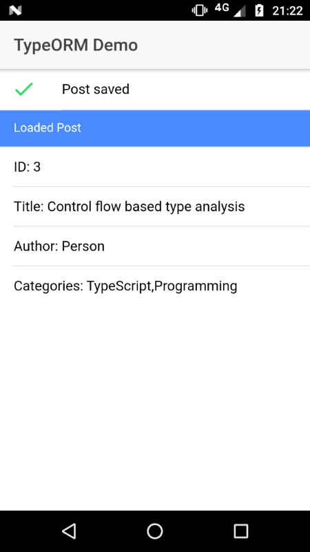

# Using TypeORM in an Ionic project
You can use TypeORM in connection with the `cordova-sqlite-storage` plugin in your Ionic app.
This project demonstrates how that would work.

## TypeORM >= 0.1.7
To support webpack builds outside of Ionic we had to remove the automatic selection of the correct TypeORM version (the `typeorm` package comes with a Node and a browser version). In order to keep using TypeORM with Ionic you have to create a custom `webpack.config.js` file. This example contains one that is identical to the one Ionic uses when no config file is specified but adds the `NormalModuleReplacementPlugin` to select the correct version.
If you already have a custom webpack config file you have to add these lines to your plugins (for both development and production):
```js
plugins: [
  ...,
  new webpack.NormalModuleReplacementPlugin(/typeorm$/, function (result) {
    result.request = result.request.replace(/typeorm/, "typeorm/browser");
  })
]
```
If you don't use a custom wepack config, copy the one from this example and add it to your `package.json` under `config`:
```json
"config": {
  "ionic_webpack": "./config/webpack.config.js"
}
``` 

### How to run this example
1. Install the ionic and cordova cli: `npm install -g cordova ionic`
2. Install all dependencies: `npm install`
3. Add a platform: `ionic cordova platform add <ios | android>`
4. Run the app: `ionic cordova run <ios | android>`. If you need help, you can read [ionic's guide](https://ionicframework.com/docs/intro/deploying/) for running an app on your device



### Using TypeORM in your own app
1. Install the plugin: `ionic cordova plugin add cordova-sqlite-storage --save`
2. Install TypeORM: `npm install typeorm --save`
3. Install node.js-Types: `npm install @types/node --save-dev`
4. Add `"typeRoots": ["node_modules/@types"]` to your `tsconfig.json` under `compilerOptions`
5. Create a custom webpack config file like the one [included in this project](config/webpack.config.js) to use the correct TypeORM version and add the config file to your [`package.json`](package.json#L12-14) (Required with TypeORM >= 0.1.7)

### Limitations to TypeORM when using production builds
Since Ionic make a lot of optimizations when building for productions, the following limitations occur
1. Entities have to be marked with the table name (eg `@Entity('table_name')`)
2. `getRepository()` has to be called with the name of the entity instead of the class (eg `getRepository('post') as Repository<Post>`)
2. Date fields aren't supported
```ts
@Column()
birthdate: Date;
```
